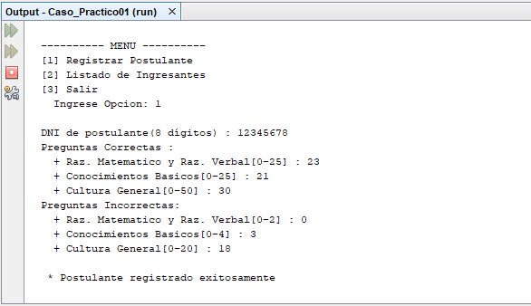

# Examen de Admisión
Sistema de ingresantes de un examen de admisión que permite registrar un las preguntas correctas e incorrectas sobre Raz. Matemático y Raz. Verbal, Conocimientos Básicos y Cultura General, además de listar los postulantes que ingresaron o no, **08/11/19**.

<strong>Imagen:</strong> Menú principal - Registrar trabajador.

